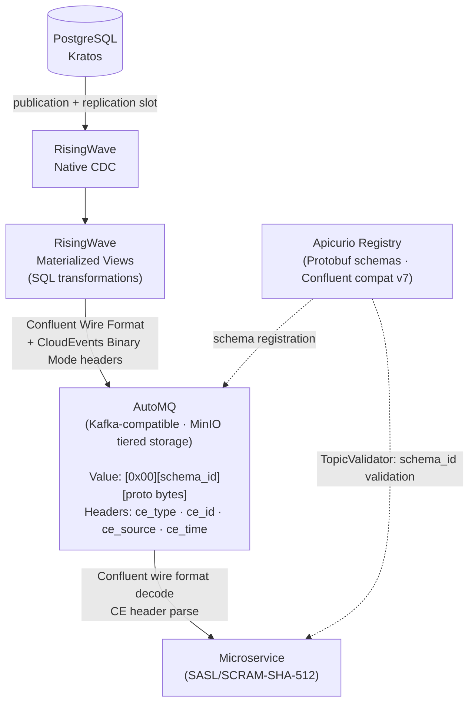

# MathTrail Contracts

## Overview

Single source of truth for MathTrail event schemas, generated Go code, AsyncAPI specification, and AsyncAPI HTML documentation portal.

**Language:** Go 1.23 (generated code) · Node.js 22 (@asyncapi/generator)
**Go module:** `github.com/mathtrail/contracts`
**Cluster:** k3d `mathtrail-dev`, namespace `streaming`

## Tech Stack

| Layer | Tool |
|-------|------|
| Schema definition | Protobuf (proto3) |
| Proto toolchain | [buf](https://buf.build) — lint, breaking change detection, generate |
| Go code generation | `buf.build/protocolbuffers/go` remote plugin |
| API specification | AsyncAPI v3 |
| Documentation portal | `@asyncapi/generator` + `@asyncapi/html-template` (generated from AsyncAPI) |
| Portal serving | nginx (static site, path `/observability/eventcatalog`) |
| Image build | buildah (CI) |

## Key Files

| File | Purpose |
|------|---------|
| `proto/students/v1/events.proto` | `StudentOnboardingReady` — consumed by microservices |
| `proto/identity/v1/events.proto` | `UserCreated`, `AddressCreated` — CDC from Kratos |
| `proto/common/v1/cloudevent.proto` | CloudEvent envelope — Variant B fallback only, NOT imported by event protos |
| `gen/go/` | Generated `.pb.go` files — committed, importable without buf |
| `asyncapi/mathtrail-events.yaml` | AsyncAPI v3 — channels, messages, CE headers, SCRAM security |
| `eventcatalog/Dockerfile` | Multi-stage: `ag` generates HTML from AsyncAPI → nginx |
| `buf.yaml` | Module `buf.build/mathtrail/contracts`, STANDARD lint, FILE breaking rules |
| `buf.gen.yaml` | Remote plugin `protocolbuffers/go`, output `gen/go/`, `paths=source_relative` |
| `justfile` | Development and CI recipes |
| `.github/workflows/ci.yml` | PR: buf lint → buf breaking → buf generate + npm build |
| `.github/workflows/release.yml` | push to main: lint/breaking → build+push `eventcatalog:<sha>` |

## Architecture

### Event Pipeline



### Schemas

| Subject (Apicurio) | Message | Topic |
|---|---|---|
| `students.v1.StudentOnboardingReady` | `StudentOnboardingReady` | `students.onboarding.ready` |
| `identity.v1.UserCreated` | `UserCreated` | `identity.users.created` |
| `identity.v1.AddressCreated` | `AddressCreated` | `identity.addresses.created` |

## CRITICAL: Schema Design Rules

**Self-contained schemas only** — no `import` directives in event proto files.
This allows direct `POST /apis/ccompat/v7/subjects/{subject}/versions` registration without the Apicurio references API.

**String for all scalar types** — use `string` for timestamps and enums:
```proto
// ✅ correct
string occurred_at = 7;  // ISO 8601

// ❌ wrong — introduces external dependency, breaks self-contained registration
google.protobuf.Timestamp occurred_at = 7;
```

`common/v1/cloudevent.proto` is isolated — event proto files **must not import it**.

## CRITICAL: Apicurio Subject Naming

Subject name **must exactly match** the `message` field in RisingWave `FORMAT PLAIN ENCODE PROTOBUF`:

```sql
-- RisingWave sink:
FORMAT PLAIN ENCODE PROTOBUF (
    schema.registry = 'http://apicurio:8080/apis/ccompat/v7',
    message = 'students.v1.StudentOnboardingReady'   ← this must match the Apicurio subject name
);
```

Register via ccompat v7 (not v2 API) to ensure subject = `{package}.{MessageName}`:
```
POST /apis/ccompat/v7/subjects/students.v1.StudentOnboardingReady/versions
```
Using the v2 API would create `default-students.v1.StudentOnboardingReady`, breaking the lookup.

## Development Workflow

```bash
just generate     # buf generate → regenerate gen/go/
just lint         # buf lint
just breaking     # buf breaking --against '.git#branch=main'
just fmt          # buf format -w
just build        # generate + lint + go mod tidy

# CI recipes (called by GitHub Actions runner)
just ci-lint      # buf lint
just ci-test      # buf breaking --against '.git#branch=main'
just ci-build     # buf generate + buildah build (AsyncAPI HTML portal)

# Build and push AsyncAPI docs image
just build-push-image "k3d-mathtrail-registry.localhost:5050/eventcatalog:local"
```

## CI/CD Pipeline

| Trigger | Jobs |
|---|---|
| PR → main | `buf lint` → `buf breaking` → `buf generate + buildah build` |
| push → main | lint/breaking (test job) → `build-push-image eventcatalog:<sha>` (release job) |

Runner: `mathtrail-runners` (self-hosted). Image pushed to `k3d-mathtrail-registry:5000/eventcatalog`.

## Adding a New Schema

1. Add or update `.proto` file in `proto/<domain>/v1/events.proto`
2. Follow schema design rules above (self-contained, string fields)
3. Run `just generate` → commit updated `gen/go/`
4. Add subject to `infra-streaming/infra/local/helm/apicurio/templates/schema-registration.yaml`
5. Add channel + message to `asyncapi/mathtrail-events.yaml`
6. PR — CI validates lint, breaking changes, and AsyncAPI portal build

## Using Generated Go Code

```go
import studentsv1 "github.com/mathtrail/contracts/gen/go/students/v1"

var msg studentsv1.StudentOnboardingReady
proto.Unmarshal(rawBytes, &msg)
```

Local development — add to consumer's `go.mod`:
```
replace github.com/mathtrail/contracts => ../contracts
```

## Development Standards

- All proto comments in English
- Field names: `snake_case` (buf FIELD_LOWER_SNAKE_CASE rule is suppressed for Avro naming compat)
- Breaking changes require explicit justification — `buf breaking` must pass in CI
- `gen/go/` is committed — consumers must not need to run buf locally
- Commit convention: `feat(contracts):`, `fix(contracts):`, `chore(contracts):`

## External Dependencies

| Repo | Purpose |
|------|---------|
| `infra-streaming` | Apicurio schema registration job consumes `.proto` content from this repo |
| Go microservices | Import generated packages from `gen/go/` to decode event messages |
| `core` | `MathTrail/core/.github/actions/setup-env@v1` loaded by CI workflows |
