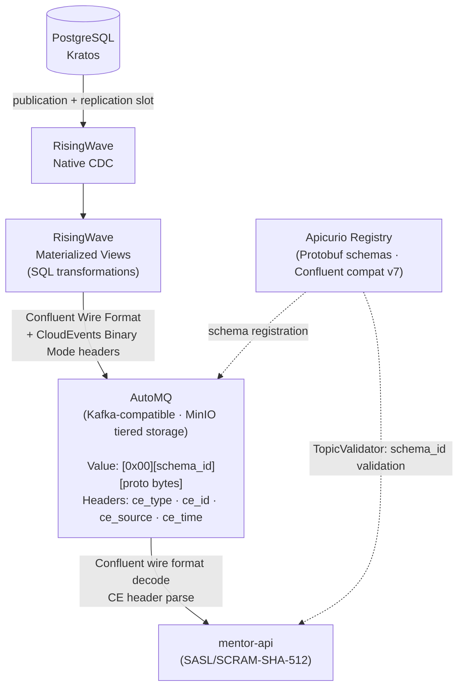

# contracts

Single source of truth for MathTrail event schemas, generated Go client code, AsyncAPI specification, and EventCatalog documentation.

## Overview

This repository defines the event contracts for the MathTrail EDA stack. It contains:

- **Protobuf schemas** — strongly-typed event definitions managed with [buf](https://buf.build)
- **Generated Go code** — committed `.pb.go` files, importable as a Go module without running `buf` locally
- **AsyncAPI v3 specification** — machine-readable channel and message contracts
- **EventCatalog** — documentation portal built from the AsyncAPI spec, deployed to the cluster at `/observability/eventcatalog`

## Event Pipeline



## Schemas

| Proto package | Message | Topic | Consumer |
|---|---|---|---|
| `students.v1` | `StudentOnboardingReady` | `students.onboarding.ready` | mentor-api |
| `identity.v1` | `UserCreated` | `identity.users.created` | — |
| `identity.v1` | `AddressCreated` | `identity.addresses.created` | — |

All fields use `string` for scalar types. Timestamps are ISO 8601 strings — no `google.protobuf.Timestamp` imports. Schemas are self-contained (no `import` directives), which allows direct registration via the Apicurio Confluent compat API without the references API.

## Repository Structure

```
contracts/
├── proto/                          # Protobuf schema definitions
│   ├── common/v1/cloudevent.proto  # CloudEvent envelope (Variant B fallback only)
│   ├── identity/v1/events.proto    # UserCreated, AddressCreated
│   └── students/v1/events.proto    # StudentOnboardingReady
├── gen/go/                         # Generated Go code (committed)
│   ├── common/v1/
│   ├── identity/v1/
│   └── students/v1/
├── asyncapi/
│   └── mathtrail-events.yaml       # AsyncAPI v3 specification
├── eventcatalog/                   # EventCatalog portal
│   ├── eventcatalog.config.js
│   ├── Dockerfile
│   └── package.json
├── buf.yaml                        # buf module config (lint + breaking rules)
├── buf.gen.yaml                    # buf code generation config
├── go.mod                          # Go module: github.com/mathtrail/contracts
└── justfile                        # Development and CI recipes
```

## Quick Start

Open in devcontainer — buf, Go, Node.js, and just are pre-installed.

```bash
# Generate Go code from proto files
just generate

# Lint proto schemas
just lint

# Check for breaking changes against main
just breaking

# Format proto files
just fmt

# Full pipeline: generate + lint + go mod tidy
just build
```

## Wire Format

Every message on AutoMQ uses **Confluent Wire Format**:

```
[0x00]  magic byte
[4 bytes]  schema_id (big-endian uint32, from Apicurio)
[n bytes]  protobuf binary payload
```

CloudEvents attributes are carried as **Kafka record headers** (Binary Mode):

| Header key | Example value |
|---|---|
| `ce_specversion` | `1.0` |
| `ce_type` | `com.mathtrail.students.onboarding.ready` |
| `ce_source` | `/mathtrail/risingwave` |
| `ce_id` | `550e8400-e29b-41d4-a716-446655440000` |
| `ce_time` | `2024-01-15T12:34:56Z` |

## Using as a Go Module

Generated Go code is committed to `gen/go/` and importable without running `buf`:

```go
import (
    studentsv1 "github.com/mathtrail/contracts/gen/go/students/v1"
    "google.golang.org/protobuf/proto"
)

var msg studentsv1.StudentOnboardingReady
if err := proto.Unmarshal(rawBytes, &msg); err != nil {
    return err
}
```

**Local development** (before tagging a release) — add a `replace` directive to `go.mod`:

```
replace github.com/mathtrail/contracts => ../contracts
```

**CI/CD** — use a tagged release (`v0.1.0`) so the `replace` directive is not needed.

## Adding a New Schema

1. Create or update a `.proto` file under `proto/<domain>/v1/events.proto`
2. Keep the schema self-contained — no `import` directives, use `string` for timestamps
3. Run `just generate` to regenerate Go code
4. Run `just lint` and `just breaking` to validate
5. Add the new subject to `infra-streaming/infra/local/helm/apicurio/templates/schema-registration.yaml`
6. Add the new channel and message to `asyncapi/mathtrail-events.yaml`
7. Commit — CI will validate lint, breaking changes, and EventCatalog build

## Schema Registration

Schemas are registered in Apicurio Registry via the Confluent compat v7 API on cluster startup:

```
POST /apis/ccompat/v7/subjects/{subject}/versions
Content-Type: application/vnd.schemaregistry.v1+json
Body: {"schemaType": "PROTOBUF", "schema": "<escaped .proto content>"}
```

Subject naming: `{package}.{MessageName}` — e.g. `students.v1.StudentOnboardingReady`.
This ensures the subject name matches exactly what RisingWave uses in `FORMAT PLAIN ENCODE PROTOBUF`.

## EventCatalog

The EventCatalog portal is built from `asyncapi/mathtrail-events.yaml` and deployed to the cluster:

```
http://<cluster>/observability/eventcatalog
```

To build the Docker image locally:

```bash
just build-push-image k3d-mathtrail-registry.localhost:5050/eventcatalog:local
```

CI builds and pushes the image on every merge to `main`.
